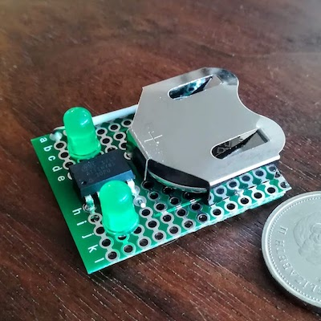

# Project Blinky

Project Blinky is a tiny, minimalist, configurable, and 
highly efficient LED flasher that will run from a single
coin cell battery or other 3V lithium source.

When the circuit is in sleep mode the current draw is only
7μA! With both LEDs on current draw is around 3.3mA. Given
that the LEDs are on for only 1.5% of the time this means 
average current draw is 58μA at 3V.

The primary power saving measures used to achieve this low
current draw are:
- Using ATTiny85 with internal 1Mhz clock
- Putting the CPU into deep sleep most of the time
- Using the watchdog timer as an interrupt to wake the CPU
- Disabling brownout detection (saves 25 µA)
- Disabling the ADC (saves 335 µA)

Info on AVR power optimization: http://www.gammon.com.au/power

#### Expected battery life:
- CR2320 (135mAh)  = 97 days
- CR2032 (240mAh)  = 172 days
- CR123A (1500mAh) = 3 years


#### Pinout Diagram:
```
                   ATTiny85
                  +---\/---+
             N/C  |1*     8|  VCC
          Led2 +  |2      7|  Led1 +
          Led2 -  |3      6|  Led1 -
             GND  |4      5|  N/C
                  +--------+
```



### Compiling/Flashing:

Project Blinky is designed to be compiled and flashed onto the
ATTiny85 using Arduino. In fact an Arduino UNO can be configured
as an ISP to flash the chip if you don't have an AVR programmer!

[Instructions for setting up to flash the ATTiny85](https://www.hackster.io/arjun/programming-attiny85-with-arduino-uno-afb829)

Set the ATTiny85 to run from the internal 1Mhz clock for the best
power efficiency.

### License

This project is available as open source under the terms of the [MIT License](http://opensource.org/licenses/MIT).